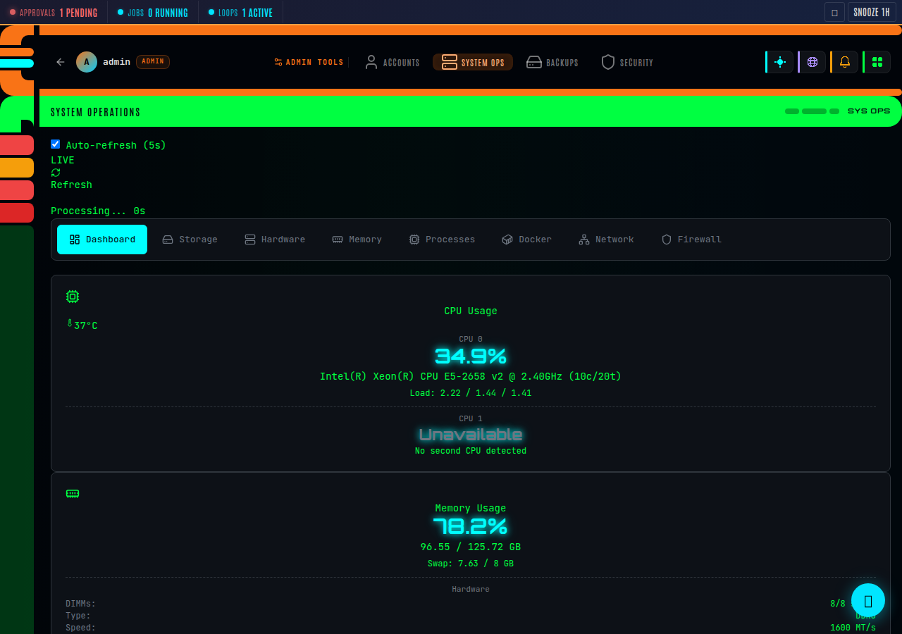
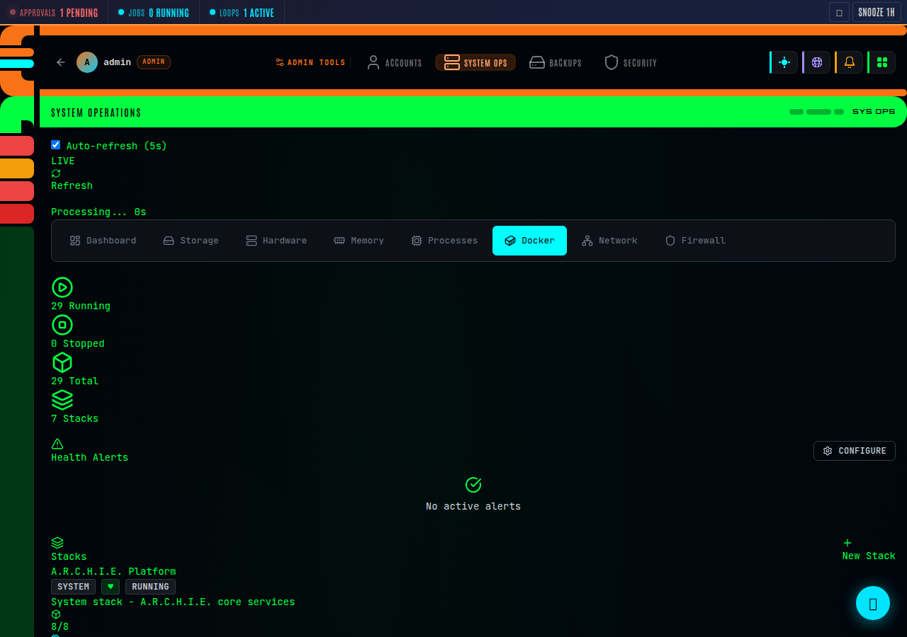
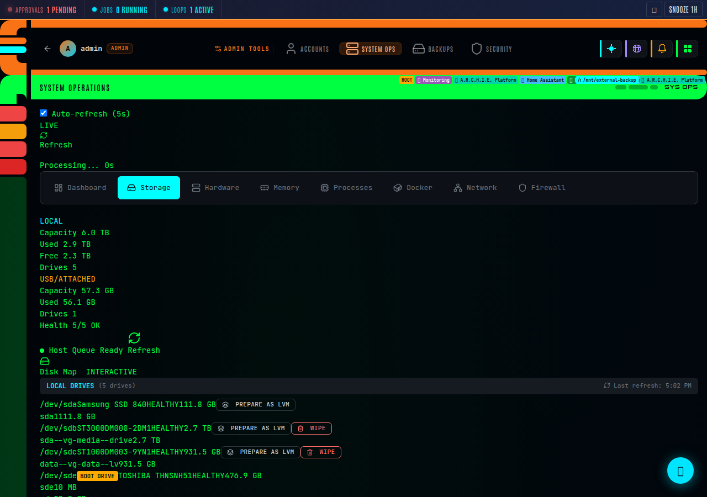
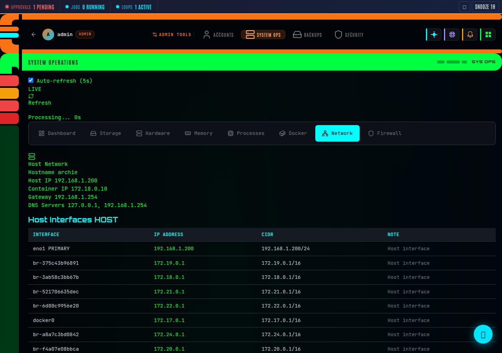
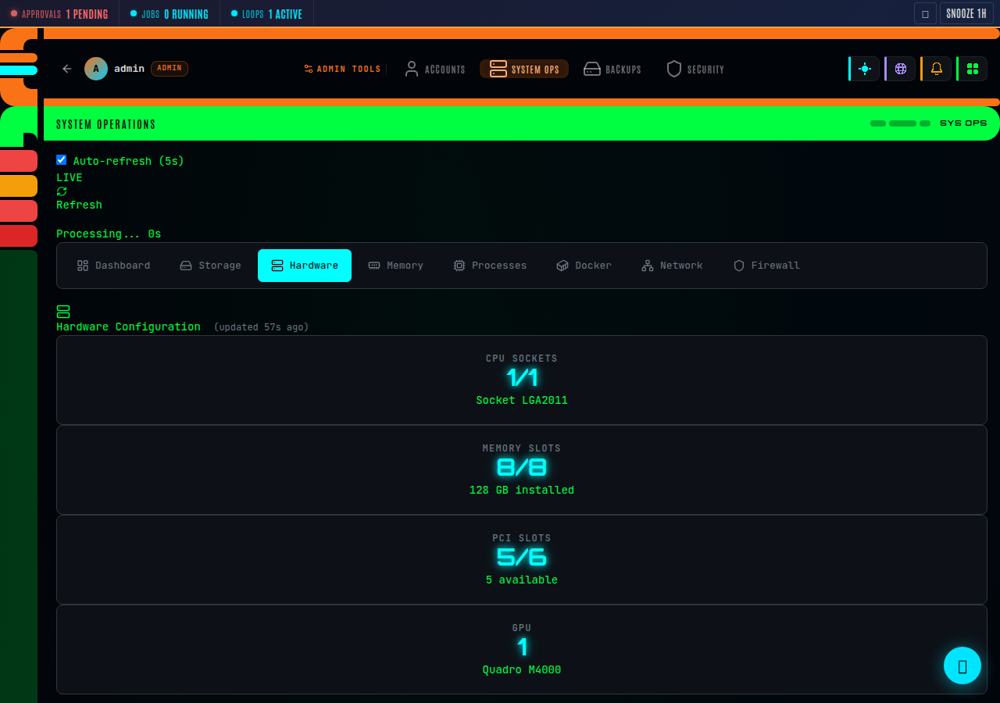
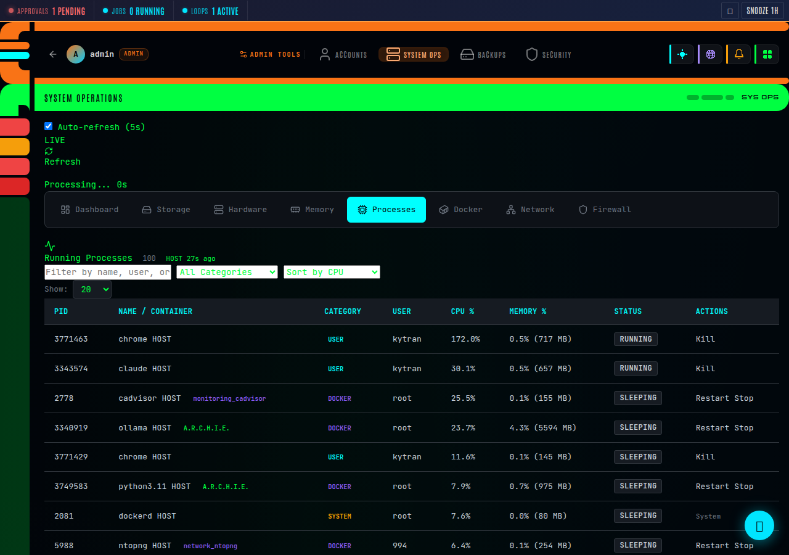

<div align="center">

# Kytran System Operations

**Self-hosted server management dashboard**

CPU • RAM • Disk • Docker • Network • Firewall — all in one beautiful interface.

[](LICENSE)
[](https://python.org)
[](https://hub.docker.com)

[Features](#features) • [Quick Start](#quick-start) • [Screenshots](#screenshots) • [Themes](#themes) • [Documentation](#documentation)

</div>

---

## Why Kytran System Operations?

Most server management tools are either too complex (Webmin), too limited (Cockpit), or focused on just containers (Portainer). Kytran System Operations gives you **everything in one place** with a clean, modern interface.

| Feature | Kytran KSO | Portainer | Cockpit | Webmin |
|---------|:---------:|:---------:|:-------:|:------:|
| CPU/RAM/Disk monitoring | ✅ | ❌ | ✅ | ✅ |
| Docker + Compose stacks | ✅ | ✅ | ✅ | ❌ |
| UFW Firewall management | ✅ | ❌ | ❌ | ✅ |
| LVM Storage management | ✅ | ❌ | ✅ | ✅ |
| Network port mapping | ✅ | ❌ | ❌ | ❌ |
| File browser | ✅ | ❌ | ❌ | ✅ |
| Process management | ✅ | ❌ | ✅ | ✅ |
| Health alerts + webhooks | ✅ | ❌ | ❌ | ❌ |
| Config-driven themes | ✅ | ❌ | ❌ | ✅ |
| Single-file install | ✅ | ✅ | ✅ | ❌ |

## Features

### 🖥️ Real-Time Monitoring
CPU, memory, disk usage with auto-refresh gauges. Hardware detection with upgrade recommendations.

### 🐳 Docker Management
Full container lifecycle — start, stop, restart, logs. Multi-stack orchestration with compose editor. Health monitoring for all stacks.

### 🔥 Firewall Management
UFW rules management — add, edit, delete rules. Enable/disable firewall. Visual rule table with port/protocol/action.

### 💾 Storage Management
Disk map with mount points, LVM volume management (extend, resize), RAID status, file browser with directory navigation.

### 🌐 Network Monitoring
Interface status, active connections, port mapping, bandwidth usage. See what's listening on which ports.

### ⚡ Process Control
Real-time process table sorted by CPU/memory. Kill processes directly. Systemd service management — start, stop, restart, enable, disable.

### 🔔 Health Alerts
Configurable alerts for CPU, memory, disk thresholds. Webhook integration for Slack, Discord, custom endpoints.

### 🎨 Themeable
Ships with five themes:
- **Kytran** (default) — Clean, modern, professional blue
- **LCARS** — Sci-fi command center (premium — cyan on black)
- **Midnight** — Purple-accented dark DevOps aesthetic
- **Arctic** — Clean light theme for bright environments
- **Ember** — Warm orange terminal aesthetic

Theme access is tier-gated: Free gets 2, Pro gets 3, Business/Enterprise gets all 5.
Select themes in Settings or set via environment variable. Create custom themes with a simple JSON config file.

## Screenshots

| Dashboard | Docker Stacks |
|-----------|--------------|
|  |  |

| Storage & LVM | Network |
|---------------|---------|
|  |  |

| Hardware Info | Processes |
|--------------|-----------|
|  |  |

## Quick Start

### pip install

```bash
pip install kytran-system-operations
kytran-system-operations
```

Open http://localhost:8085 and create your admin account.

### Docker

```bash
docker run -d \
  --name kytran-system-operations \
  -p 8085:8085 \
  -v /var/run/docker.sock:/var/run/docker.sock \
  -v kso-data:/data \
  ghcr.io/kytrankatarn/kytran-system-operations
```

### Docker Compose

```yaml
version: "3.8"
services:
  kytran-system-operations:
    image: ghcr.io/kytrankatarn/kytran-system-operations
    ports:
      - "8085:8085"
    volumes:
      - /var/run/docker.sock:/var/run/docker.sock
      - kso-data:/data
      - /proc:/host/proc:ro
      - /sys:/host/sys:ro
    environment:
      - KSO_SECRET_KEY=your-secret-key
      - KSO_THEME=kytran
    restart: unless-stopped

volumes:
  kso-data:
```

## Configuration

| Environment Variable | Default | Description |
|---------------------|---------|-------------|
| `KSO_SECRET_KEY` | `change-me` | Flask secret key |
| `KSO_PORT` | `8080` | Server port |
| `KSO_HOST` | `0.0.0.0` | Bind address |
| `KSO_THEME` | `kytran` | Theme name (`kytran`, `lcars`, `midnight`, `arctic`, `ember`) |
| `KSO_DATA_DIR` | `~/.kytran-system-operations` | Data directory (SQLite DB) |
| `KSO_DEBUG` | `false` | Debug mode |

## Themes

Create a custom theme by adding a JSON file to the `themes/` directory:

```json
{
  "product_name": "My Server Manager",
  "frame_style": "modern",
  "colors": {
    "accent": "#8b5cf6",
    "bg_primary": "#1a1a2e"
  },
  "fonts": {
    "heading": "Inter",
    "body": "Inter"
  }
}
```

Set `KSO_THEME=mytheme` to use it.

## Tech Stack

- **Backend:** Python, Flask
- **Frontend:** Vanilla JS, Chart.js
- **Database:** SQLite (zero-config)
- **System Data:** psutil
- **Auth:** bcrypt + Flask-Login

## License

Apache 2.0 — [Kytran Empowerment Inc.](https://kytranempowerment.com)

---

<div align="center">

**Built with ❤️ by [Kytran Empowerment](https://kytranempowerment.com)**

</div>
